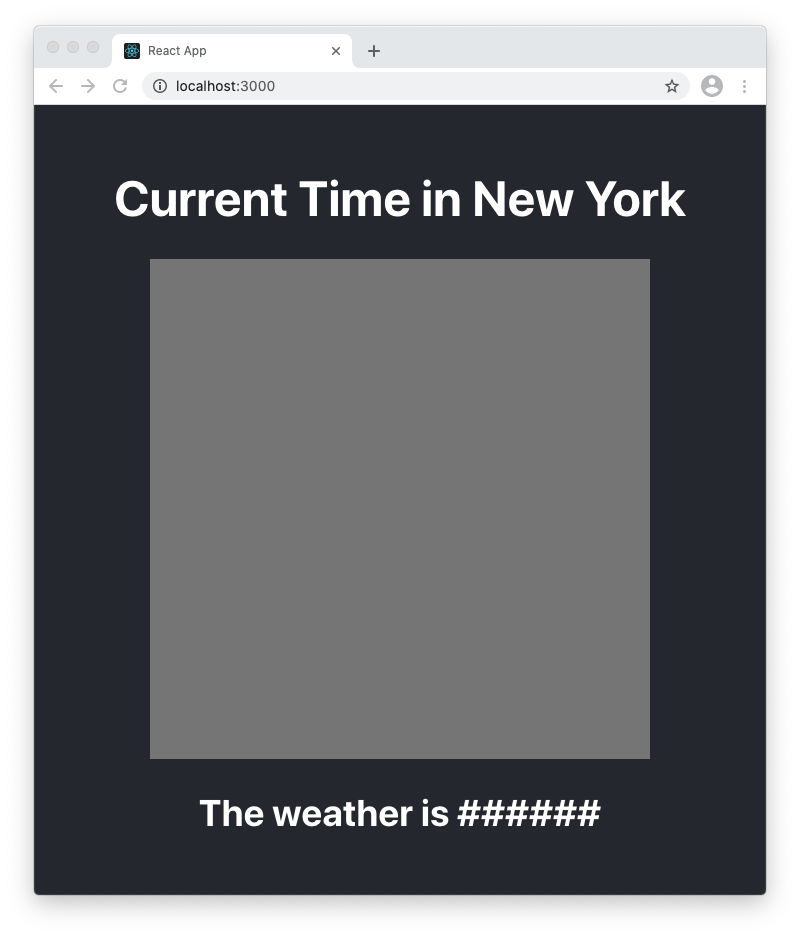

# EY-frontend-screening-test
Application to test for Frontend candidates

## Your mission
You are responsible for implementing a weather clock.

1. Fork this repository 
2. Update `Clock.jsx` and `Weather.jsx` accordingly. 
3. Create unit tests for any new code written as well as instructions for how to run then.
4. Provide any additional instructions for how to run the application.
5. Upon completing the features, raise a pull request to `main` and also include a screenshot/gif of your solution in `README.md`. 

We will look at the elegance of your code, the effectiveness of your unit tests, and the overall look and feel of your solution. 

### Analog Clock
1. In `Clock.jsx`, create a component that renders an analog clock. The clock should show the current time in New York City (EST), so please adjust the time zones accordingly

### Current Weather
2. In `Weather.jsx`, use any public Weather API to fetch the current weather in New York City and render the `Weather` component in `App.js`

## Solution: 
_Post a screenshot or gif of your implementation here:_
